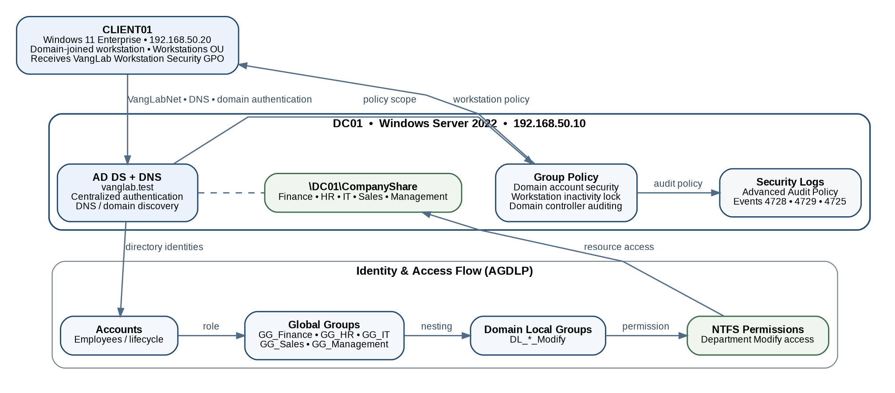

# Identity & Access Governance + Risk Mapping Lab

Hands-on Active Directory lab demonstrating identity governance, role-based access control, least privilege, Group Policy, auditing, and employee lifecycle management.

## Project Overview

Built a simulated small-business Active Directory environment using Windows Server 2022 and Windows 11 Enterprise.

The lab includes:

* `DC01` domain controller and DNS server
* `CLIENT01` domain-joined workstation
* `vanglab.test` Active Directory domain
* Department-based users and security groups
* Centralized `\\DC01\CompanyShare`
* AGDLP-based permissions
* Group Policy security controls
* Active Directory auditing and lifecycle testing

## Key Security Work

* Created structured OUs for users, groups, workstations, service accounts, and disabled users
* Implemented AGDLP and department-based RBAC
* Applied least-privilege Share and NTFS permissions
* Validated authorized and unauthorized folder access
* Configured password and account lockout policies
* Applied automatic workstation inactivity locking
* Enabled AD security auditing
* Validated Security events 4728, 4729, and 4725
* Simulated employee onboarding, department transfer, and offboarding
* Mapped controls to NIST CSF 2.0 and CIS Controls v8

## Architecture

## Documentation

* [Final Project Report](docs/Identity_Access_Governance_Final_Project_Report_Portfolio_Ready.pdf)
* [Master Project Documentation](docs/Identity_Access_Governance_Master_Project_Documentation.pdf)
* [Security Validation Evidence](evidence/)

## Technologies

Windows Server 2022 • Active Directory Domain Services • DNS • Windows 11 Enterprise • Group Policy • NTFS Permissions • Event Viewer • Oracle VirtualBox

> All users, systems, addresses, and organizational data in this project are part of a simulated lab environment.

All users, systems, addresses, and organizational data used in this project are part of a simulated lab environment.
